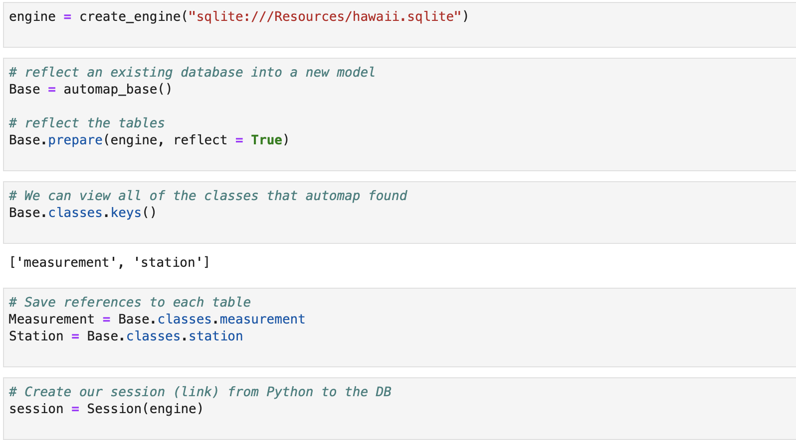
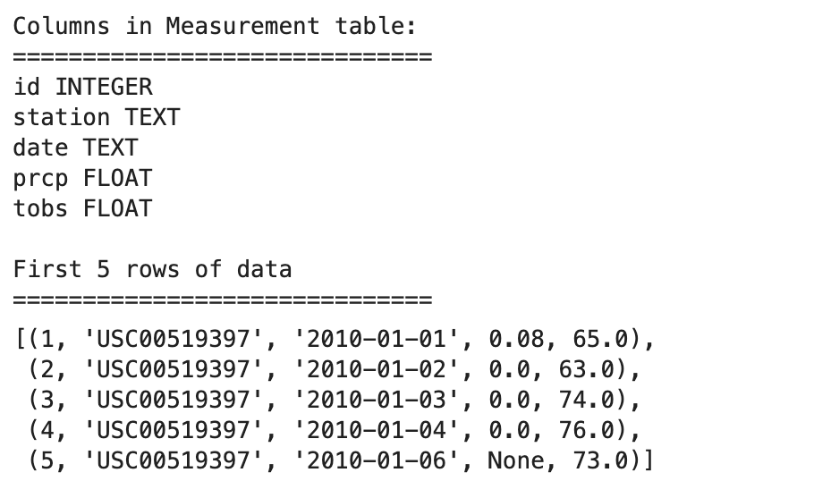
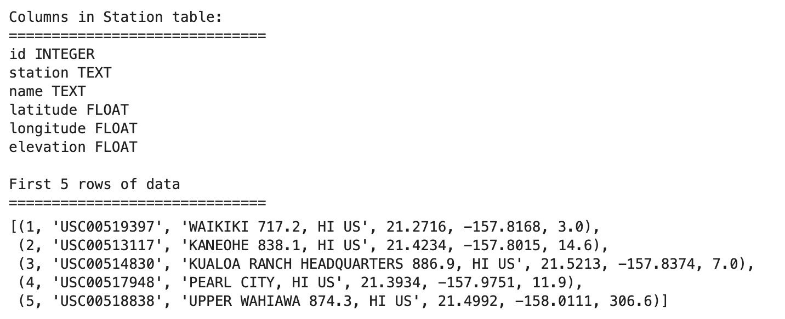
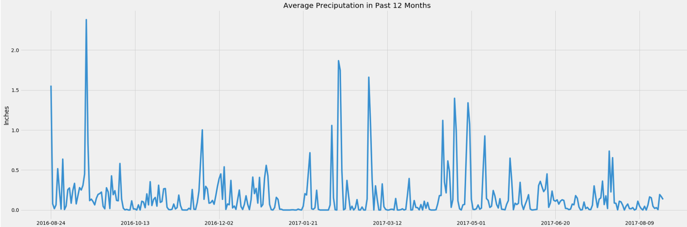
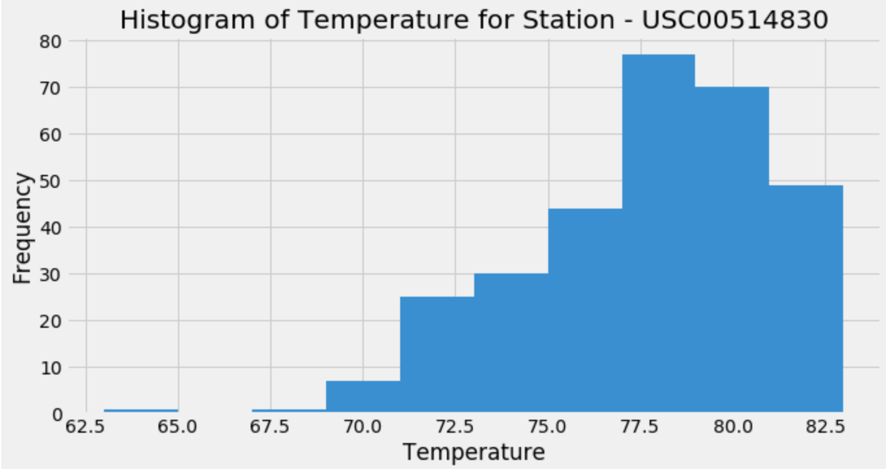

# sqlalchemy_challenge

### **Overall:**
#### This project has two parts: Part 1, I use Python and SQLAlchemy to do basic climate analysis and data exploration of your climate database. Part 2, I create a Flask API called `climate_app` to query the data.

### **Part 1 - Data Analysis**
#### Step1: Create engine and reflect tables into ORM
 

#### Step2: Data Exploration
 
 

#### Step3: Precipitation Analysis
 

#### Step4: Station Analysis
 

### **Part 2 - Building Flask API**

